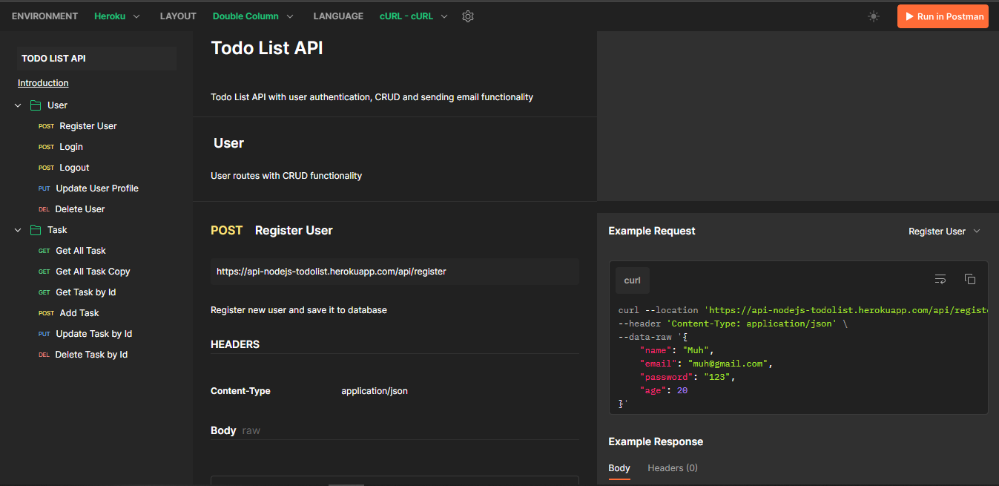

<p align="center"><a href="https://laravel.com" target="_blank"></a></p>

<p align="center">
<a href="https://github.com/laravel/framework/actions"></a>
<a href="https://packagist.org/packages/laravel/framework"></a>
<a href="https://packagist.org/packages/laravel/framework"></a>
<a href="https://packagist.org/packages/laravel/framework"></a>
</p>

# To-Do List Backend API

Este é o projeto de backend da API para um aplicativo To-Do List construído em Laravel. Ele fornece endpoints para criar, listar, atualizar e excluir tarefas em uma lista de afazeres.

## Pré-requisitos

Certifique-se de ter os seguintes pré-requisitos instalados em seu ambiente:

- PHP
- Composer
- Laravel
- Postman (para testar a API)

## Instalação

1. Clone este repositório em seu ambiente:

   ```bash
   git clone https://github.com/seu-usuario/todo-list-backend.git
   ```

2. Acesse o diretório do projeto:

    ```bash
    cd todo-list-backend
    ```

3. Instale as dependências do Composer:

    ```bash
    composer install
    ```

4. Crie um arquivo de ambiente .env com suas configurações. Você pode copiar o arquivo .env.example e ajustar as configurações de banco de dados:

    ```bash
    cp .env.example .env
    ```


5. Gere uma chave de aplicativo:
    ```bash
    php artisan key:generate
    ```

6. Execute as migrações do banco de dados para criar as tabelas:

    ```bash
    php artisan migrate
    ```

7. Inicie o servidor:

    ```bash
    php artisan serve
    ```

## Funcionalidades

### Usuário

- **POST**: Registro de Usuário
- **POST**: Login de Usuário
- **POST**: Logout de Usuário
- **PUT**: Atualização do Perfil do Usuário
- **DELETE**: Exclusão de Usuário

### Tarefa

- **GET**: Obter Todas as Tarefas
- **GET**: Obter Todas as Tarefas (Cópia)
- **GET**: Obter Tarefa por ID
- **POST**: Adicionar Tarefa
- **PUT**: Atualizar Tarefa por ID
- **DELETE**: Excluir Tarefa por ID

## Documentação da API

Para obter mais informações sobre as chamadas da API, você pode verificar a documentação completa no [Postman](https://documenter.getpostman.com/view/25826644/2s9Y5Tz5J8).



## Como Usar

Você pode usar o Postman ou qualquer outra ferramenta para testar esses endpoints.

Exemplo de solicitação POST para criar uma tarefa:

POST /api/tasks

{
  "description": "Pão, leite, ovos"
}


### Testando a API com Postman
1. Abra o Postman.

2. Você pode utilizar essa [API de exemplo](https://documenter.getpostman.com/view/25826644/2s9Y5Tz5J8)

3. Crie uma nova solicitação e selecione o método (GET, POST, PUT, DELETE) e a URL apropriada.

4. Adicione os parâmetros da solicitação, se necessário.

5. Envie a solicitação e visualize a resposta da API.

Certifique-se de que a API esteja em execução (etapa 7 da instalação) antes de testar os endpoints.

### Contribuição
Fique à vontade para contribuir para este projeto. Sinta-se à vontade para abrir problemas, enviar solicitações de pull e propor melhorias.

### Licença
Este projeto é licenciado sob a [Licença MIT](https://opensource.org/licenses/MIT).
